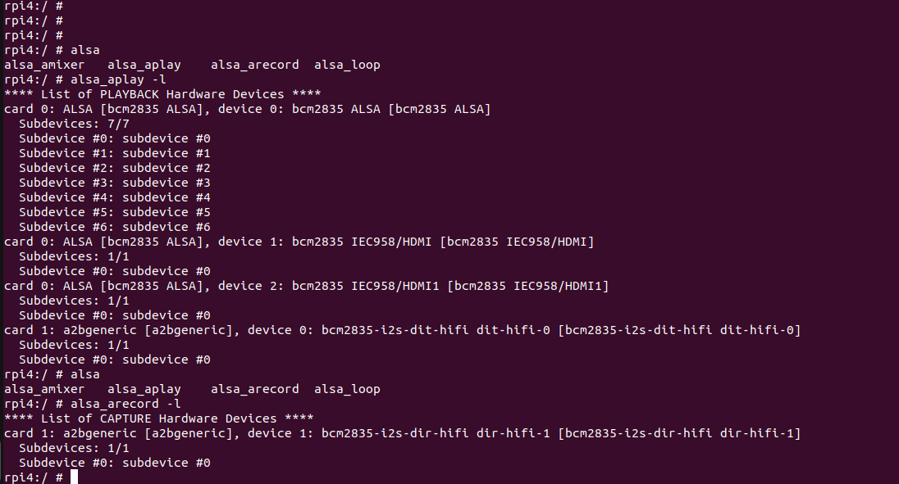

# a2bgeneric_snd_card
This project provides an example of adding A2B transceiver as a sound card in the Android Common Kernel on Raspberry Pi 4B

## AOSP Integration on RPI 4B
Followed the below page for the integration of AOSP into RPI 4B.

https://grapeup.com/blog/android-automotive-os-13-on-raspberry-pi-4b/

### AOSP RPI 4B Kernel

Cloned the Linux Kernel by following the below github repo:

https://github.com/raspberry-vanilla/android_kernel_manifest/tree/android-13.0

1. Initially built without any modifications using the commands as per the above github
2. Added the DTS overlay file (rpi-a2bgeneric-overlay.dts) in the Kernel path "arch/arm/boot/dts/overlays"
3. Make sure the below configs are enabled (=y) (Didn't verified with loadable kernel modules)

    - CONFIG_SND_SOC
    - CONFIG_SND_BCM2835_SOC_I2S
    - CONFIG_SND_SIMPLE_CARD
    - CONFIG_SND_SOC_SPDIF
4. Make sure I2S is enabled ("okay") in the BCM2711 DTS
5. Build the Kernel
6. Replace the new Kernel image, DTB & DTBO's in the path prebuilts path of the android repo
7. Build the Android image (boot image alone can also be built as there will be only change in the boot)
8. Once Android boots up & connect to the adb terminal, list the sound cards. In this step, "a2bgeneric" will also be listing as a sound card in the list. Please find the below snippet of sound cards in RPI 4B.

    

## Contributing thanks for the below page/blog authors
 - Grapeup (explaining about the AOSP integration into RPI 4B)
 - Raspberry - Vanilla Github repo
 - Kernel documentation reference for adding A2B as a Simple Sound Card: 
    - https://www.kernel.org/doc/Documentation/devicetree/bindings/sound/simple-card.txt
 - Reference for creating a simple sound card:
    - https://github.com/AkiyukiOkayasu/RaspberryPi_I2S_Slave/blob/master/genericstereoaudiocodec.dts

